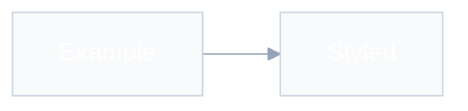
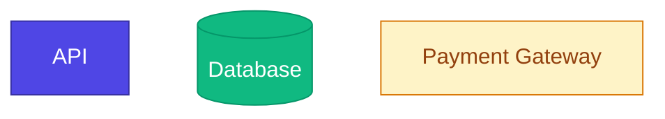

# Mermaid Diagrams

Create diagrams that are **correct**, **readable**, and **visually polished** — not default black-box exports.

## When to use

| User intent | Action |
|---|---|
| "Draw a diagram of…" | Pick type → draft with styling → embed or output |
| "Improve this Mermaid" | Fix layout, density, labels, and theme |
| Diagram inside `docs/technical/` | Follow this skill + add a one-line caption |
| Render to PNG/SVG | Output `.mmd` source; suggest `npx @mermaid-js/mermaid-cli` if export is needed |

**Complements** `technical-documentation` and `refining-docs` — those skills say *what* to diagram; this skill says *how* to make it look professional.

## Workflow

1. **Clarify purpose** — one sentence: what should the reader learn?
2. **Pick diagram type** — use the decision matrix below; suggest alternatives if unclear
3. **Draft structure** — nodes, edges, grouping; stay under 15 nodes
4. **Apply theme** — init directive + semantic `classDef`; verify text/background contrast
5. **Review** — run the quality checklist before delivering

## Diagram type decision matrix

| User describes… | Type | Keyword |
|---|---|---|
| Process, workflow, decision tree | Flowchart | `flowchart TD` or `flowchart LR` |
| API calls, request/response, messaging | Sequence | `sequenceDiagram` |
| Database schema, entities | ER | `erDiagram` |
| OOP model, domain classes | Class | `classDiagram` |
| Lifecycle, status transitions | State | `stateDiagram-v2` |
| System context (people + systems) | C4 | `C4Context` / `C4Container` |
| Chronological events | Timeline | `timeline` |
| Git branching | Git graph | `gitGraph` |

If none fit, name the closest option and why.

## Golden rules

### 1. Always theme — never ship default black lines

Default Mermaid uses harsh black edges. Every diagram MUST start with an `%%{init}` block **before** the diagram type line.

**Standard light theme** (use for most docs):



**Do not** set `fontFamily` in theme variables — headless renderers fall back to Times New Roman.

### 2. Text contrast — pair fill and label colour

Every coloured node, subgraph, or theme variable with a custom background MUST use readable text:

| Background | Text colour | Typical use |
|---|---|---|
| Light (`#f8fafc`, `#fef3c7`, `#ffffff`) | Dark (`#1e293b`, `#334155`, `#92400e`) | Subgraphs, warning/external nodes |
| Medium–dark (`#4f46e5`, `#10b981`, `#3730a3`) | White (`#ffffff`) | Primary services, data stores |
| Dark doc theme (`#1e293b`, `#0f172a`) | White (`#ffffff`, `#f8fafc`) | `textColor`, `titleColor`, `primaryTextColor` |

**Rules:**

- Set `primaryTextColor` and `textColor` in `%%{init}` to match the overall theme (dark text on light docs, light text on dark docs).
- In every `classDef`, always set `color:` explicitly — never rely on Mermaid defaults after a custom `fill`.
- Light fill + white text, or dark fill + dark text, is an automatic fail — fix before delivering.

**Dark doc theme** (when embedding in dark-mode docs or dark README backgrounds):


### 3. Soft lines

`lineColor: '#94a3b8'` (slate-400) is the single biggest visual upgrade. For dark backgrounds use `#64748b`.

### 4. Limit density

- **Max ~15 nodes** per diagram; split larger systems into linked diagrams
- Use `subgraph` for logical groups with meaningful titles
- Prefer `LR` for pipelines and sequential flows; `TD` for hierarchies
- Use invisible spacing links (`A ~~~ B`) only when layout is cramped

### 5. Meaningful labels

- Node IDs: `camelCase` (`orderService`, not `s1`)
- Display labels: short natural language (`[Order Service]`)
- Edge labels: verb phrases (`"Validates via API"`)
- Match codebase terminology where the diagram documents real systems

### 6. Semantic colour — max 3–4 hues

Map meaning, not decoration:

| Meaning | Palette | Example hex |
|---|---|---|
| Primary / internal services | Blue | `#4f46e5`, `#3b82f6` |
| Data stores / success paths | Green | `#10b981`, `#059669` |
| External systems / warnings | Amber | `#f59e0b`, `#d97706` |
| Lines, borders, secondary | Slate | `#64748b`, `#94a3b8` |
| Errors only | Red | `#ef4444` |

Apply via `classDef`, not per-node inline `style`. **Always set `color` on each `classDef` to contrast with `fill`:**



Dark fills → `color:#ffffff`. Light fills → `color:#1e293b` or a dark shade that matches the hue.

### 7. Modern syntax

- `flowchart TD` not `graph TD`
- `stateDiagram-v2` not legacy `stateDiagram`
- Quote labels that contain special characters

## Layout by diagram type

### Flowcharts

- Shapes carry meaning: `([])` start/end, `{}` decisions, `[ ]` process, `[( )]` storage, `[/ /]` input/output
- One primary direction; avoid crossing arrows when possible
- Name subgraphs after the bounded context (`subgraph api [API Layer]`)

### Sequence diagrams

- Order participants left-to-right by initiation (caller first)
- Use `autonumber` for multi-step flows in docs
- Prefer `alt`/`opt`/`loop` over duplicating sequences
- Theme sequence diagrams with the same init block

### ER diagrams

- Cardinality on every relationship
- Entity names match schema (`USER` or `User` — pick one convention per project)
- Show only fields that matter for the diagram's purpose

### C4 diagrams

C4 has fixed element colours but **harsh default relationship lines**. Every C4 diagram MUST end with:

```
UpdateRelStyle(from, to, $textColor="#475569", $lineColor="#94a3b8")
UpdateLayoutConfig($c4ShapeInRow="3", $c4BoundaryInRow="1")
```

- Max **6 `Rel()` calls** per diagram — split if more connections are needed
- Prefer tree topologies over meshes

## Embedding in markdown

Fence as ` ```mermaid ` (not ` ``` ` alone). Add a one-line caption immediately after:

````markdown

*Caption: how authenticated requests reach the API.*
````

For chat responses, a fenced `mermaid` block is enough unless the user asked for a file.

## Quality checklist

Before delivering, verify:

- [ ] `%%{init}` present with soft `lineColor`
- [ ] Text contrasts with every custom background (white on dark fills, dark on light fills)
- [ ] `primaryTextColor` / `textColor` in init match light or dark doc theme
- [ ] Under 15 nodes (or split with a note linking follow-on diagrams)
- [ ] Labels readable without jargon; IDs are camelCase
- [ ] Colours map to meaning; red used only for errors
- [ ] `classDef` used instead of scattered inline styles
- [ ] Correct diagram type and flow direction
- [ ] Valid syntax (balanced brackets, quoted special chars)
- [ ] Caption added when diagram lives in a doc file

## What matters vs what does not

| Important | Low priority / skip |
|---|---|
| Clarity of message | Pixel-perfect layout tuning |
| Consistent theme across a doc set | Animated or 3D effects |
| Soft lines and readable contrast (text vs fill) | Custom fonts |
| Right diagram type | Matching a specific brand guide unless provided |
| Splitting complex views | Fitting everything in one diagram |
| Semantic colour (3–4 hues) | Rainbow nodes for decoration |
| Captions in documentation | Export format unless user asks |

## Anti-patterns

- Bare `flowchart` with no init — looks unfinished
- `s1`, `n2`, `box3` node IDs — unreadable in source diffs
- 25+ nodes in one chart — split it
- Inline `style` on every node — use `classDef`
- Red for non-error emphasis
- White text on light `fill` (or dark text on dark `fill`) — unreadable labels
- Diagram with no prose context in docs
- `graph` keyword for new flowcharts

## Troubleshooting

| Symptom | Fix |
|---|---|
| Harsh black lines | Add init with `lineColor: '#94a3b8'` |
| Text invisible / low contrast | Dark text on light fills; white text on dark fills; set `color` in every `classDef` |
| Nodes overlap | Fewer nodes, `subgraph`, or split diagram |
| Labels truncated | Shorten text or use `<br/>` sparingly |
| Won't render | Check quotes, brackets, and reserved words |
| C4 spaghetti arrows | Fewer `Rel()` calls; add `UpdateRelStyle` |
| Wrong layout | Try `LR` vs `TD`; reorder node declarations |

## Additional examples

For before/after refactors and per-type templates, see [examples.md](examples.md).
