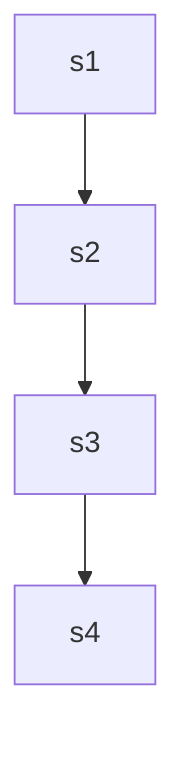
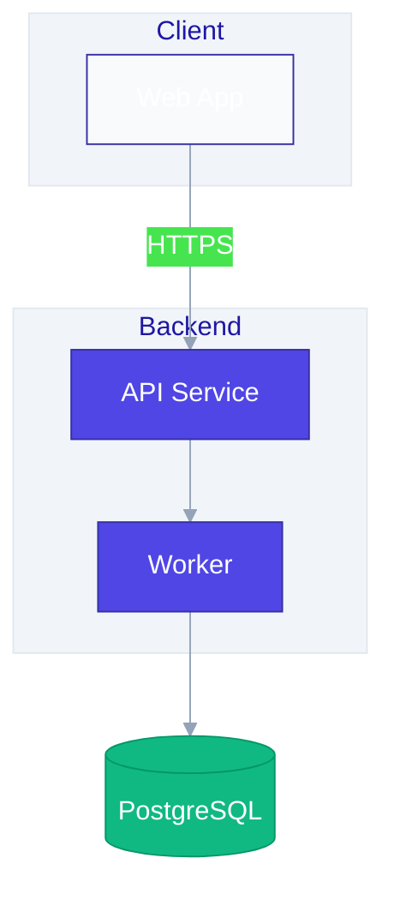
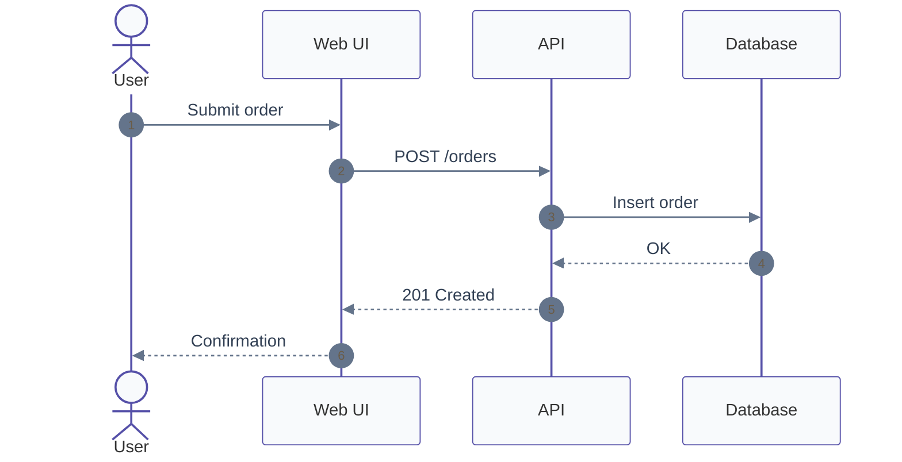
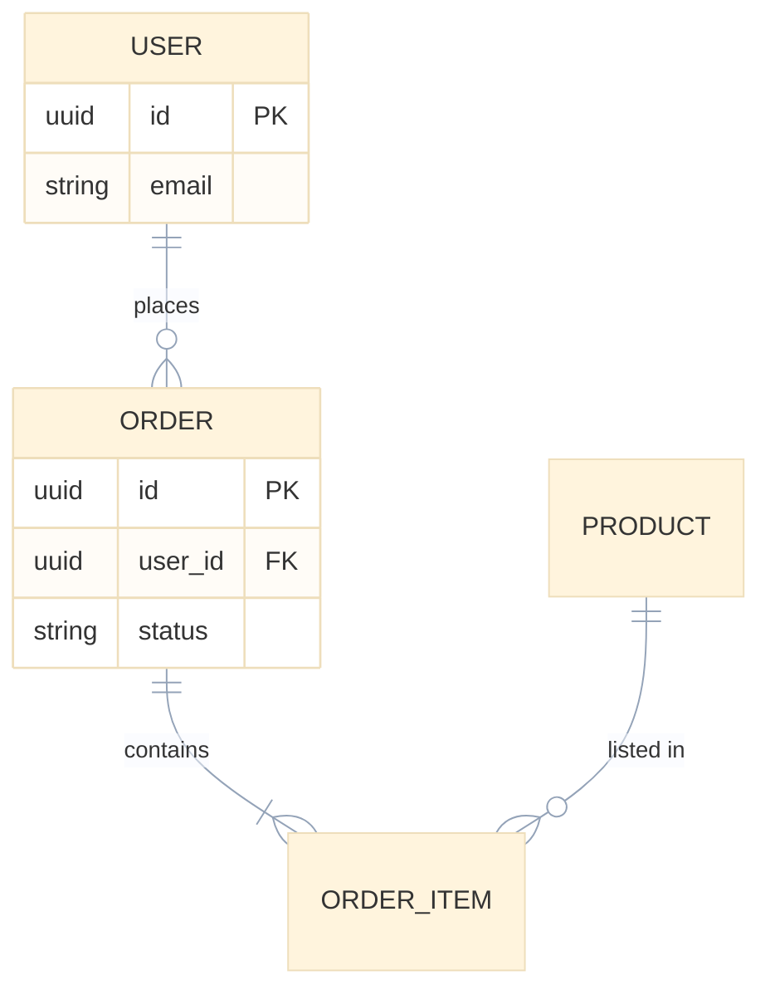
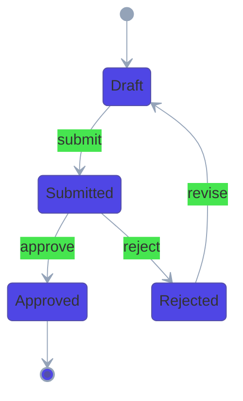
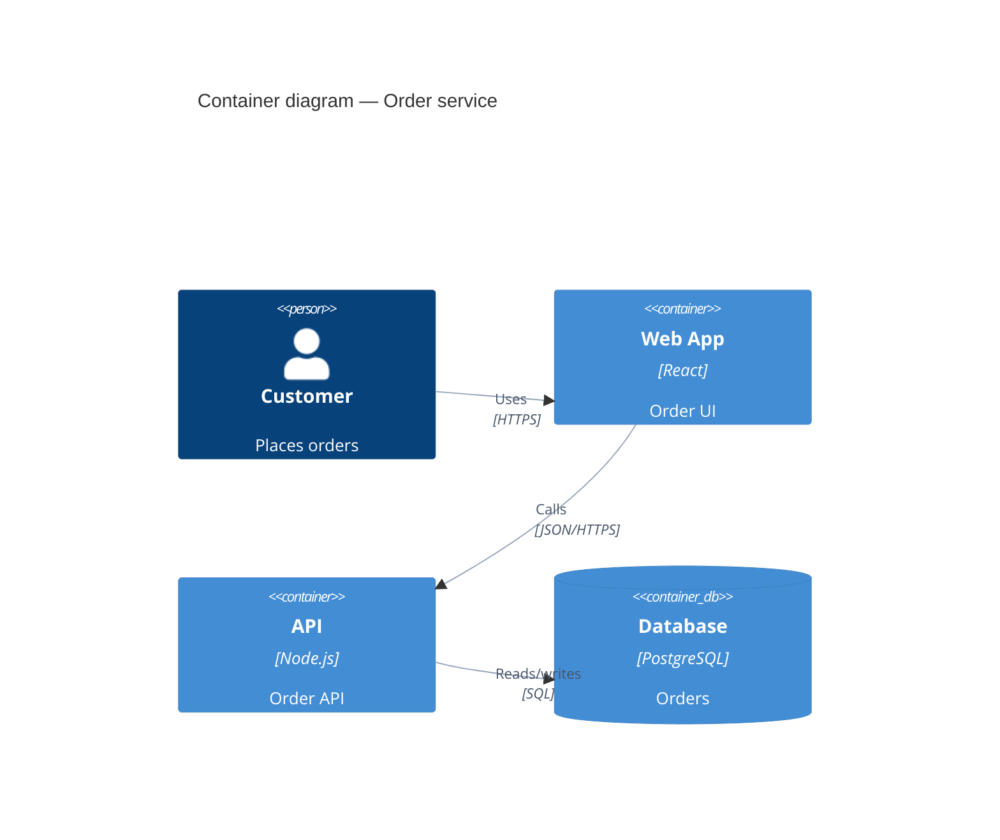

# Mermaid Diagram Examples

Reference patterns for the mermaid-diagrams skill. Read when drafting a specific diagram type.

## Before and after: amateur vs professional

### Before (default styling, vague IDs)

Problems: `graph` syntax, no theme, cryptic IDs, no labels, no grouping.

### After (themed, labelled, grouped)

## Request flow (sequence)

## Data model (ER)

## State machine

## C4 container (with mandatory line styling)

## Splitting a complex system

When a system has more than ~15 components, produce a **series**:

1. **Context** — C4Context: users and external systems
2. **Containers** — C4Container: apps, APIs, databases
3. **Flows** — one sequence diagram per non-trivial path

Link them in prose: *"See Order submission sequence for the path from Web App to Payment Gateway."*
