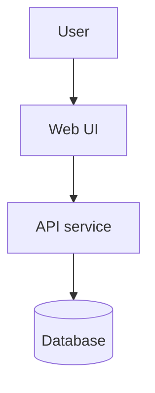
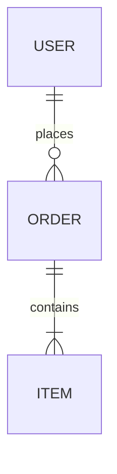

# Technical Documentation

Turn a rough design into the technical documents an AI agent needs to build a modern, production-ready application — and that a human can read, review, and tune. The AI will write all the code. The human's job is to get these documents right first: define what the app does, lock the decisions that matter, and explicitly hand the rest to the agent.

Announce at start: "I'm using the technical-documentation skill to write the technical docs."

Do not write application code in this skill. The output is documentation.

## Where this sits

```
brainstorming  →  technical-documentation  →  planning  →  executing-plans
docs/designs/      docs/technical/             docs/plans/
```

Brainstorming produces a design spec (the *what and why*). This skill expands it into the *how* — structured, standalone documents. Planning then turns those into TDD tasks.

## Prerequisites

- An approved design spec (from brainstorming) or clear requirements from the user
- If requirements are still fuzzy, suggest the brainstorming skill first

## Output location

- Default: `docs/technical/<doc-name>.md` (one file per document)
- User's preferred location overrides the default
- Keep the set in one folder so cross-references and a future `CLAUDE.md`/`AGENTS.md` can point at it

## The document set

Scale the set to the project — do **not** generate all nine for a small tool. Propose a subset, confirm it, then draft.

| Doc | File | Owner | Purpose |
|---|---|---|---|
| Product Brief | `product-brief.md` | Human | Vision, users, problem, success metrics. Often seeded from the brainstorming spec. |
| Requirements (PRD) | `requirements.md` | Human | Features, user stories, acceptance criteria, explicit out-of-scope. |
| Architecture | `architecture.md` | AI-drafted, human-tuned | System context, components, data flow. |
| Tech Stack & Decisions | `tech-stack.md` | Mixed | Every language/framework/library choice, tagged by owner, with rationale. |
| Data Model | `data-model.md` | AI-drafted, human-tuned | Entities, relationships, schema. |
| API / Interface Contracts | `api-contracts.md` | AI-drafted, human-tuned | Endpoints or interfaces, payloads, errors. |
| Non-Functional Requirements | `nfr.md` | Human-guided | Performance, security, scale, accessibility — with measurable targets. |
| Engineering Guidelines | `engineering-guidelines.md` | Mixed | Conventions, testing strategy, structure. Seeds `CLAUDE.md`/`AGENTS.md`. |
| UI Requirements | `ui-requirements.md` | Human-guided | Design system needs, brand identity, accessibility. **For UI projects only.** Feeds design-system skill. |
| Doc Changelog | `CHANGELOG.md` | Human | REQ-level history of doc changes — feeds reconciling-changes. |

### Picking the subset

| Project type | Suggested core | Usually skip |
|---|---|---|
| CLI / script / small library | product-brief, requirements, architecture, tech-stack, engineering-guidelines | api-contracts, data-model, ui-requirements |
| Web app / SaaS | all nine | — |
| API / backend service | all except thin product-brief and ui-requirements | — |
| Data / ML pipeline | product-brief, requirements, architecture, data-model, tech-stack, nfr | api-contracts, ui-requirements |

Always propose, never assume. Let the user add or drop docs.

## Decision ownership — the core mechanic

Every technical choice gets an explicit owner so nothing stays ambiguous past review:

- 🔒 **human-locked** — the human decided this; the agent must not change it
- 🤖 **agent-discretion** — the agent may choose and revise this during build
- ❓ **needs-decision** — open; must be resolved before hand-off

Surface choices as you draft. Default a choice to 🤖 only when the human has no stated preference — and say so, so they can override. No row leaves the final docs as ❓.

## The flow

### 1. Intake — read what already exists

Before drafting anything, scan for existing material and report what you found:

- The brainstorming design spec (`docs/designs/`)
- `README.md`, existing `docs/`, any product brief, PRD, or notes the user already wrote
- Existing code conventions if this is brownfield

Summarise in a few sentences: what's already defined, what's missing, what conflicts. **Reconcile existing docs — never silently overwrite them.** If the user already wrote a product brief, build on it.

### 2. Scope the set

Propose the document subset (table above) for *this* project and why. Get agreement before drafting.

> "For a CLI tool I'd write four docs: product-brief, requirements, architecture, tech-stack. Skipping data-model and api-contracts — there's no persistent data or external API. Sound right?"

**✋ Checkpoint — wait for confirmation.**

### 3. Draft document by document

For each doc in the set:

1. Draft it from the template (below), pulling from intake material
2. Present it section by section — scale depth to complexity
3. Surface every technical decision with a 🔒/🤖/❓ tag and ask which the user wants to lock
4. Revise until the section matches their intent

> "Does this match what you had in mind?"

**✋ Review checkpoint per document** before moving to the next.

### 4. Consistency pass

Once all docs are drafted, check the set agrees with itself:

- Tech stack named in `architecture.md` matches `tech-stack.md`
- Entities in `data-model.md` cover everything `requirements.md` needs
- `api-contracts.md` endpoints map to requirements
- No ❓ decisions left anywhere
- NFR targets are measurable (numbers, not "fast")

Fix inconsistencies inline.

### 5. Final review

Ask the user to read the files on disk:

> "Technical docs saved to `docs/technical/`. Have a read — especially the 🔒 decisions in `tech-stack.md` — and tell me what to change before we plan implementation."

**✋ Approval gate — wait.**

### 6. Hand off

When approved, suggest the next step based on context:

> "Docs approved. Want me to turn these into an implementation plan with the planning skill?"

For projects with UI, if `ui-requirements.md` exists, suggest **design-system** before planning implementation:

> "UI requirements are approved. Want me to run the design-system skill next so the brand, tokens, typography, spacing, and component standards are locked before component work starts?"

For brownfield projects with existing code, suggest **conformance-check** first, then planning when ready.

Also offer to seed `CLAUDE.md`/`AGENTS.md` from `engineering-guidelines.md` if the project doesn't have one. Don't start planning or coding without the go-ahead.

## Diagrams and tables

- **Mermaid** for all diagrams — it renders on GitHub, is editable as text, and an agent can update it. Fence as ` ```mermaid `.
  - System/component view → `flowchart` or C4-style `graph`
  - Data model → `erDiagram`
  - Request/interaction flows → `sequenceDiagram`
  - Lifecycle/status → `stateDiagram-v2`
- **Tables** for any decision matrix, comparison, field list, or requirement set.
- Every diagram needs a one-line caption saying what it shows. A diagram without prose is half a document.

## Document templates

Adapt headings to the project; don't pad a small project with empty sections.

### product-brief.md

```markdown
# <Product> — Product Brief

**Status:** Draft | Approved   **Last updated:** YYYY-MM-DD

## Problem
What problem, for whom, and why it matters now.

## Users
Primary and secondary users. What each needs.

## Goals & success metrics
| Goal | How we measure it | Target |
|---|---|---|

## Out of scope
What this product deliberately does not do.
```

### requirements.md

```markdown
# <Product> — Requirements (PRD)

> Requirements use stable **REQ-IDs** for traceability through plans, tests, and impact reports.
> Format: `REQ-NNN` for features, `REQ-NNN-ACn` for acceptance criteria.

## Features
For each feature: a user story and testable acceptance criteria.

### REQ-001: <name>
**Status:** active | deprecated | removed
**Introduced:** YYYY-MM-DD
**Last changed:** YYYY-MM-DD

**As a** <user> **I want** <capability> **so that** <benefit>.

**Acceptance criteria**
- [ ] REQ-001-AC1: <observable, testable condition>
- [ ] REQ-001-AC2: <observable, testable condition>

## Out of scope (this release)
- <explicitly excluded item>
```

### architecture.md

````markdown
# <Product> — Architecture

## Overview
2–4 sentences: shape of the system and the approach.

## System diagram

*Caption: high-level components and how requests flow.*

## Components
| Component | Responsibility | Talks to |
|---|---|---|

## Key flows
A sequence diagram for each non-trivial flow.
````

### tech-stack.md

```markdown
# <Product> — Tech Stack & Decisions

## Stack
| Layer | Choice | Owner | Rationale |
|---|---|---|---|
| Language | TypeScript | 🔒 human-locked | Team standard |
| Framework | <choice> | 🤖 agent-discretion | No stated preference |

> Owner legend: 🔒 human-locked (agent must not change) · 🤖 agent-discretion · ❓ needs-decision

## Decision records
### ADR-001: <title>
**Context** · **Decision** · **Owner** · **Consequences**
```

### data-model.md

````markdown
# <Product> — Data Model


*Caption: core entities and relationships.*

## Entities
### User
| Field | Type | Constraints | Notes |
|---|---|---|---|
````

### api-contracts.md

```markdown
# <Product> — API / Interface Contracts

## <METHOD> <path>
**Purpose** · **Auth** ·
**Request** (schema/table) · **Response** (schema/table) · **Errors** (table)
```

### nfr.md

```markdown
# <Product> — Non-Functional Requirements

| Category | Requirement | Target | How verified |
|---|---|---|---|
| Performance | p95 API latency | < 200ms | Load test |
| Security | Auth on all write endpoints | 100% | Review + test |
| Accessibility | WCAG level | 2.1 AA | Audit |
```

### engineering-guidelines.md

```markdown
# <Product> — Engineering Guidelines

## Conventions
Naming, file structure, formatting, error handling.

## Testing strategy
What gets tested and how. Coverage expectations. Every REQ-ID should map to at least one test.

## Agent rules (non-negotiable)
Rules the AI must follow on every change. This section seeds CLAUDE.md / AGENTS.md.

- Cite the REQ-ID(s) each change satisfies
- Never delete code or tests outside the current delta plan's scope
- Never change a 🔒 human-locked decision without explicit human approval
- Read existing implementation before modifying — prefer surgical edits on brownfield code
- If a test fails outside the planned scope, stop and report — do not fix forward
- Run the full test suite before and after each batch; unrelated failures block progress
```

### ui-requirements.md

Create this for any project with visual UI, components, pages, mobile screens, or a design system. This is the hand-off into the **design-system** skill.

```markdown
# <Product> — UI Requirements

> These requirements define the design-system inputs. The design-system skill converts them into design tokens, component standards, and audit rules.

## UI/UX requirements

### Target platforms
- [ ] Web desktop
- [ ] Web mobile
- [ ] Tablet
- [ ] Native mobile

**Primary platform:** <e.g. Web desktop-first, mobile-responsive>

### Accessibility
**Standard:** WCAG 2.1 AA | WCAG 2.2 AA | WCAG AAA

**Must support:**
- [ ] Screen readers
- [ ] Keyboard navigation
- [ ] High contrast mode
- [ ] Reduced motion
- [ ] Text scaling up to 200%

### Browser/device support
| Target | Requirement |
|---|---|
| Chrome/Edge | <version or policy> |
| Firefox | <version or policy> |
| Safari | <version or policy> |
| Mobile | <iOS/Android requirements> |

## Brand identity

### Brand values
| Value | Meaning for UI |
|---|---|
| <e.g. Trustworthy> | <how it should feel visually> |

### Voice and tone
- **Overall voice:** <e.g. Professional yet friendly>
- **Error states:** <e.g. Empathetic and helpful>
- **Success states:** <e.g. Encouraging and concise>
- **Marketing/product copy:** <e.g. Clear and confident>

### Visual style direction
- **Style:** <Minimalist | bold | corporate | playful | other>
- **Mood:** <Calm | energetic | serious | approachable | other>

## Colour requirements

### Brand colours
| Role | Value / description | Owner |
|---|---|---|
| Primary brand colour | <hex/HSL or description> | 🔒 |
| Secondary brand colour | <hex/HSL or description> | 🔒 / 🤖 |
| Accent colour | <hex/HSL or description> | 🔒 / 🤖 |

### Semantic colours
| Role | Requirement |
|---|---|
| Success | <e.g. Green, clear but calm> |
| Error/destructive | <e.g. Red, clear but not alarming> |
| Warning | <e.g. Amber/orange> |
| Info | <e.g. Blue> |

### Theme support
- [ ] Light mode
- [ ] Dark mode
- [ ] System preference

**Default:** <Light | Dark | System>

## Typography requirements

### Font direction
- **Heading font:** <specific font or personality>
- **Body font:** <specific font or personality>
- **Monospace font:** <if needed>
- **Font loading policy:** <system fonts only | web fonts allowed>

### Readability
- **Minimum body size:** <e.g. 16px>
- **Body line-height:** <e.g. 1.5>
- **Max reading line length:** <e.g. 75 characters>

## Layout and spacing

### Layout style
- [ ] Spacious
- [ ] Compact
- [ ] Balanced

### Grid and spacing
- [ ] 4px spacing grid
- [ ] 8px spacing grid
- [ ] 12-column layout grid
- [ ] Other: <specify>

### Responsive approach
**Approach:** Mobile-first | Desktop-first

**Key breakpoints:** <e.g. 640px, 768px, 1024px>

## Component style requirements

| Component family | Requirement |
|---|---|
| Buttons | <shape, sizes, hover/focus behaviour> |
| Forms | <input style, validation timing, error display> |
| Cards | <elevation, border, spacing> |
| Navigation | <top nav, side nav, mobile behaviour> |
| Feedback | <toast, alert, inline message patterns> |
| Data display | <tables, lists, charts, density> |

## Interaction patterns

- **Transitions:** <none | subtle 200ms | rich animation>
- **Loading states:** <spinner | skeleton | progress | other>
- **Empty states:** <icon + copy + CTA | illustration | text only>
- **Motion accessibility:** Must respect `prefers-reduced-motion`: yes | no

## Existing design assets

| Asset | Location / status | Owner |
|---|---|---|
| Figma/design file | <link or none> | 🔒 |
| Brand guidelines | <link/path or none> | 🔒 |
| Logo/assets | <link/path or none> | 🔒 |
| Base design system | <shadcn/ui | Material UI | custom | other> | 🔒 / 🤖 |
| Icon library | <Lucide React | Heroicons | custom | other> | 🔒 / 🤖 |

## Component requirements

### Required primitives
- [ ] Button
- [ ] Input
- [ ] Select/combobox
- [ ] Checkbox/radio
- [ ] Card
- [ ] Dialog/sheet/drawer
- [ ] Toast/alert

### Required composed components and patterns
- [ ] Data table
- [ ] Dashboard header
- [ ] Navigation shell
- [ ] Auth form
- [ ] Empty states
- [ ] Loading states
- [ ] AI/tool invocation components

## Decision ownership
| Decision | Owner |
|---|---|
| Brand colours, logo, existing brand guidelines | 🔒 human-locked |
| Accessibility standard | 🔒 human-locked |
| Specific fonts, if provided | 🔒 human-locked |
| Semantic token mapping | 🤖 agent-discretion unless specified |
| Spacing scale, radii, shadows | 🤖 agent-discretion unless specified |
| Component variants and sizes | 🤖 agent-discretion unless specified |

## Hand-off to design-system

The design-system skill must use this document to create:
1. Design tokens
2. Typography scale
3. Spacing, radius, shadow, and motion standards
4. Component decision framework
5. Backwards compatibility and component audit rules
```

## Self-check before final review

- Every doc reads standalone — no reliance on chat history
- No ❓ decisions remain; every tech choice is 🔒 or 🤖
- Diagrams render (valid Mermaid) and each has a caption
- NFR targets are measurable
- UI projects have `ui-requirements.md`, and its human-locked brand/accessibility decisions are resolved
- Docs are internally consistent (stack, entities, endpoints all line up)
- No TBD/TODO/placeholder text

## Principles

- **Human defines, agent builds** — the human owns intent and locked decisions; the agent owns the rest
- **Explicit ownership** — no decision stays ambiguous; tag it or resolve it
- **Adaptive, not exhaustive** — document what the project needs, nothing more
- **Incremental validation** — agree section by section, not all at once
- **Standalone docs** — each file is readable cold
- **YAGNI** — no speculative architecture for features that aren't in scope

## Anti-patterns

- Generating all eight docs for a small tool
- Leaving tech choices untagged or as ❓ at hand-off
- Diagrams with no caption or prose
- Overwriting the user's existing docs instead of reconciling
- Writing application code in this skill
- Vague NFRs ("should be fast", "must be secure")
